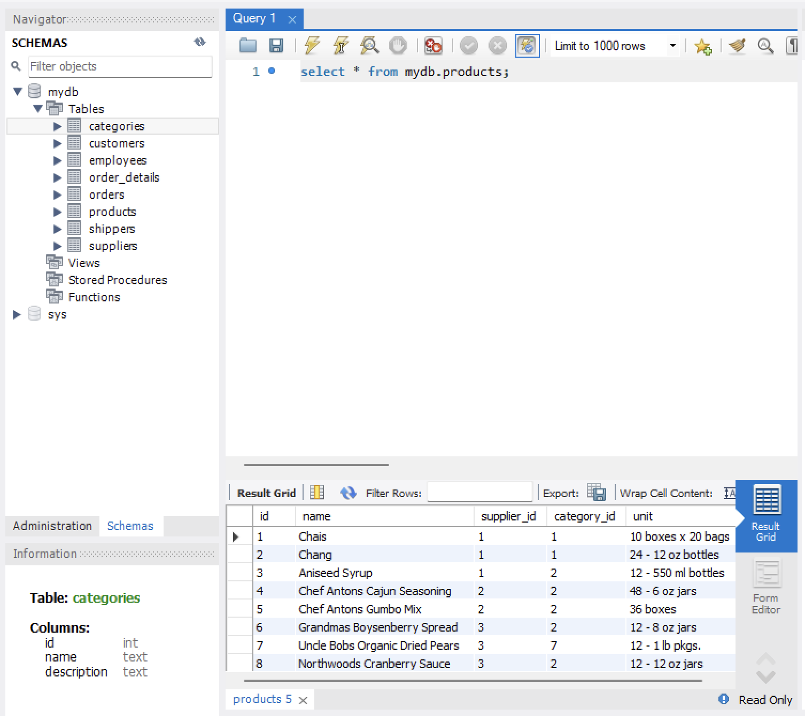
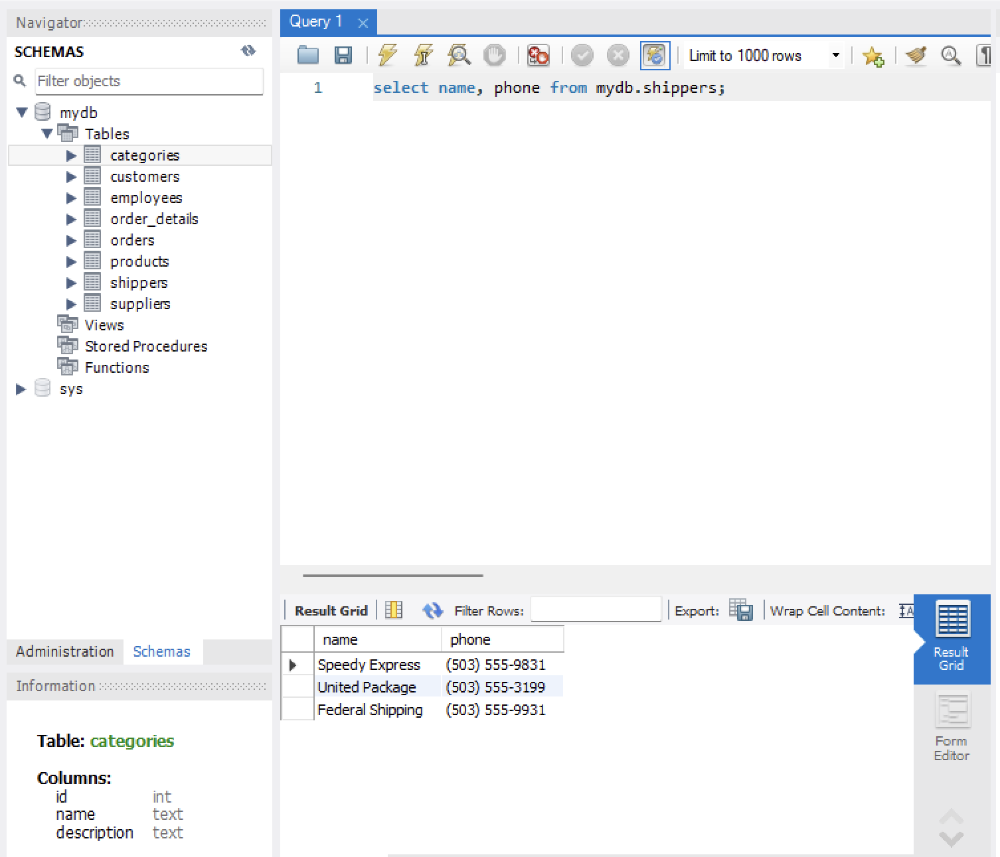
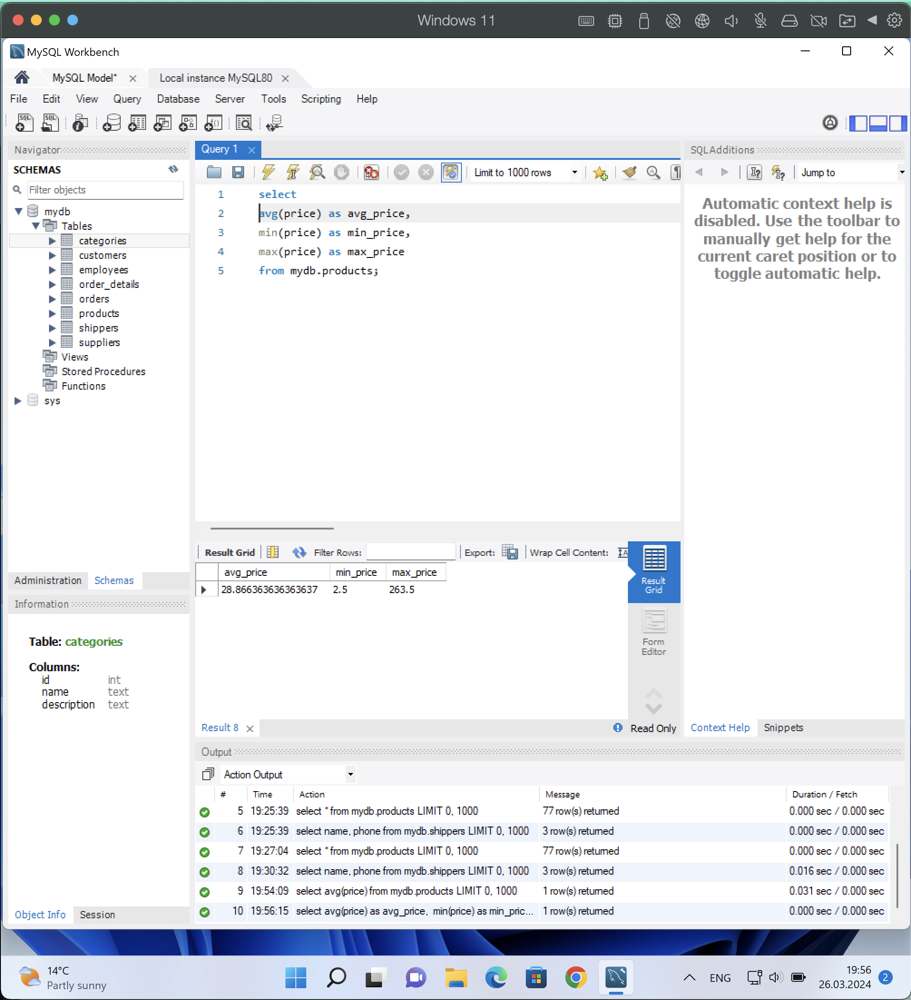
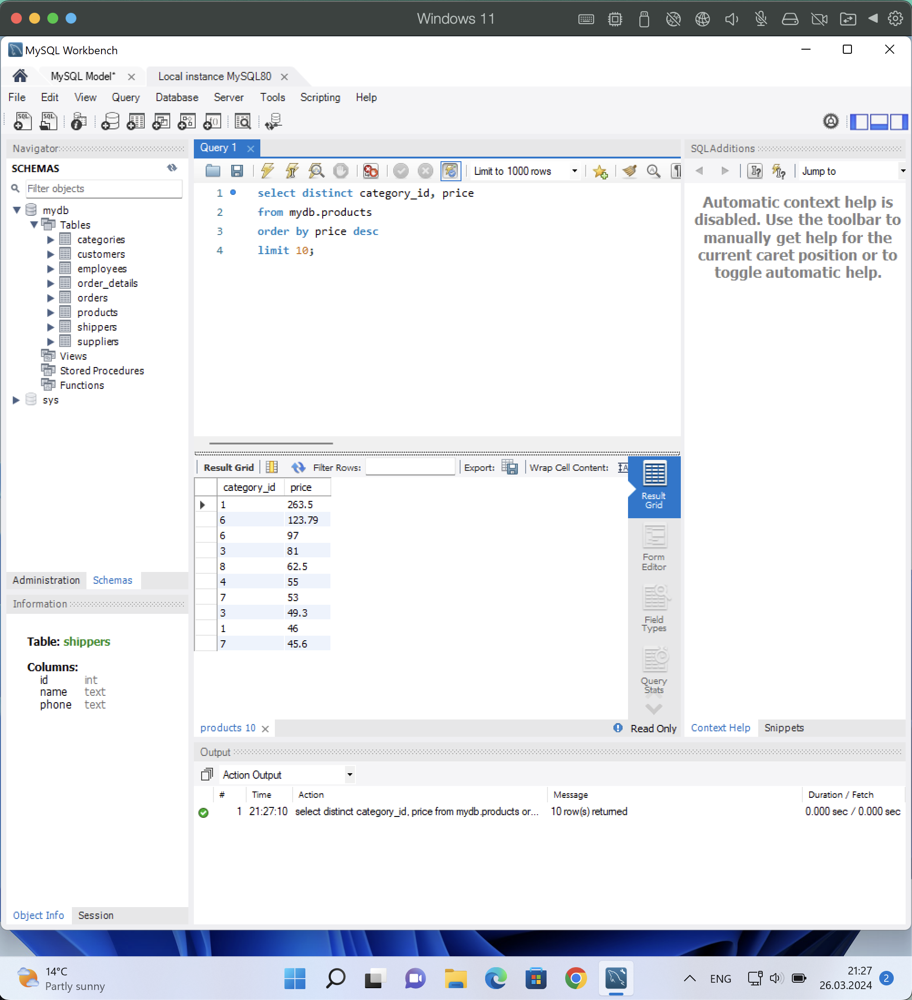
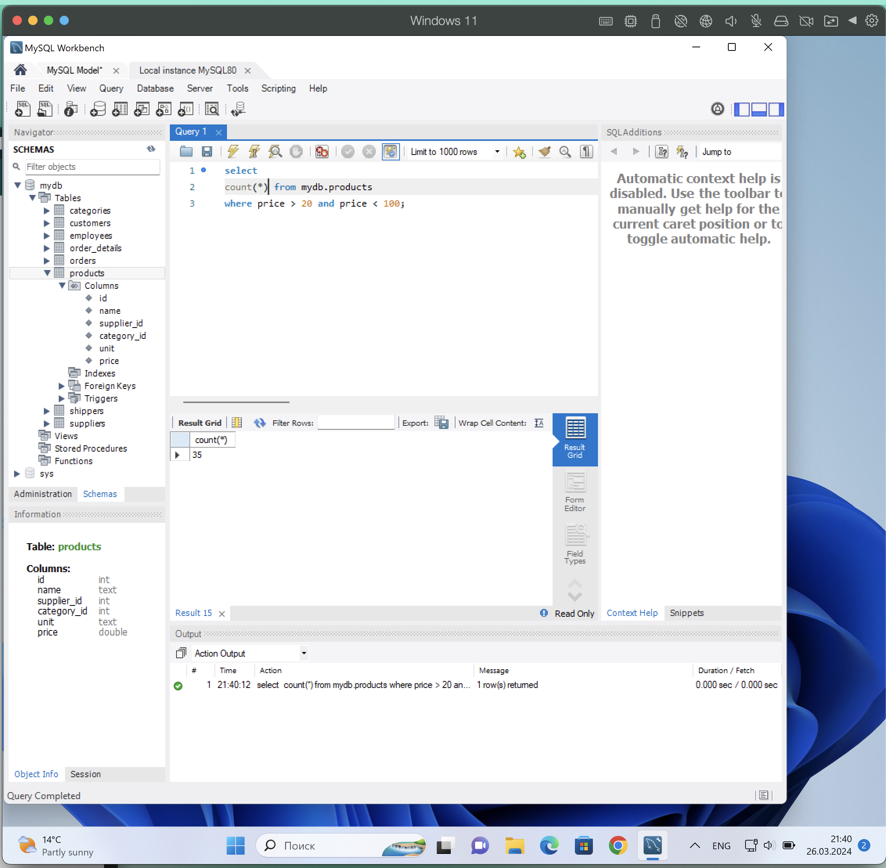
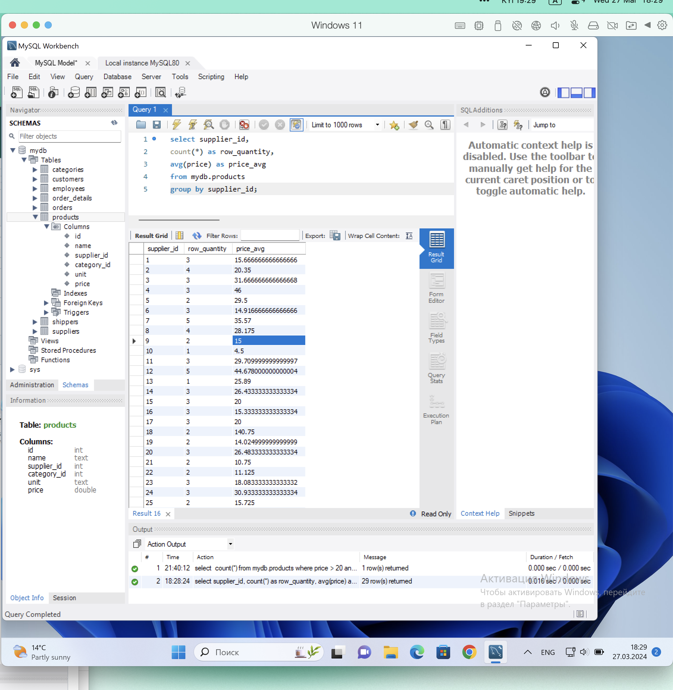

# woolf-rdb-hw-03

1. Write an SQL command for:

- Select all columns from the "products" table (using wildcard "*").
  
- Select the columns "name" and "phone" from the "shippers" table.
  

2. Write an SQL command to find the average, maximum, and minimum value of the "price" column in the "products" table.
   

3. Write an SQL command to select unique values of the columns "category_id" and "price". Order the output by descending "price" values and select only 10 rows.
   

4. Write an SQL command to find the number of products (rows) that have prices within the range from 20 to 100.
   

5. Write an SQL command to find the number of products (rows) and the average price (price) for each supplier (supplier_id).
   
